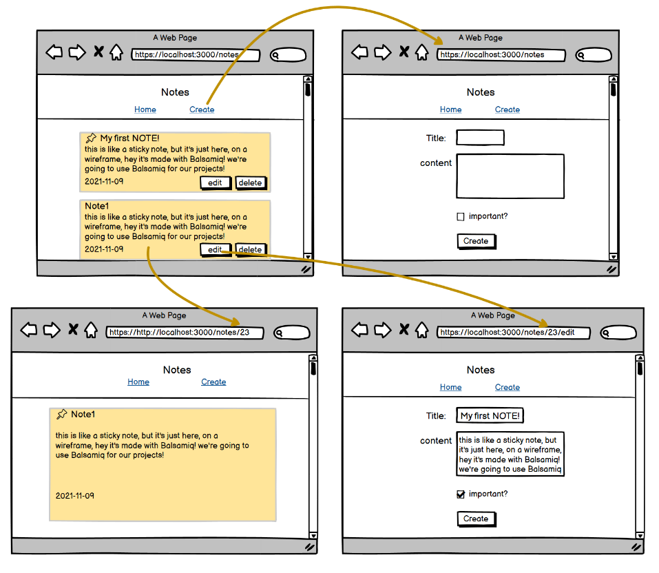

# MERN - Notes Full-Stack demo

## React 18 + Router 6

go to `/client` and `npm install`
go to `/server` and `npm install`

from `/client` run `npm start`
from `/server` run `nodemon server.js`

You may reference the code.
Remember the rules of academic dishonesty.
